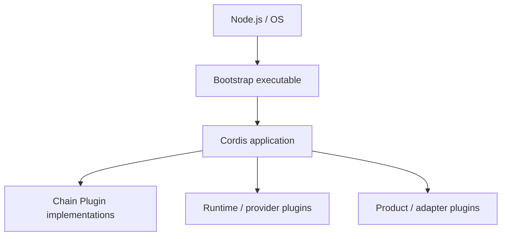
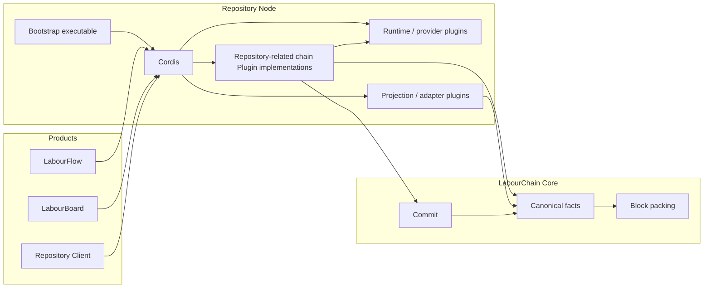
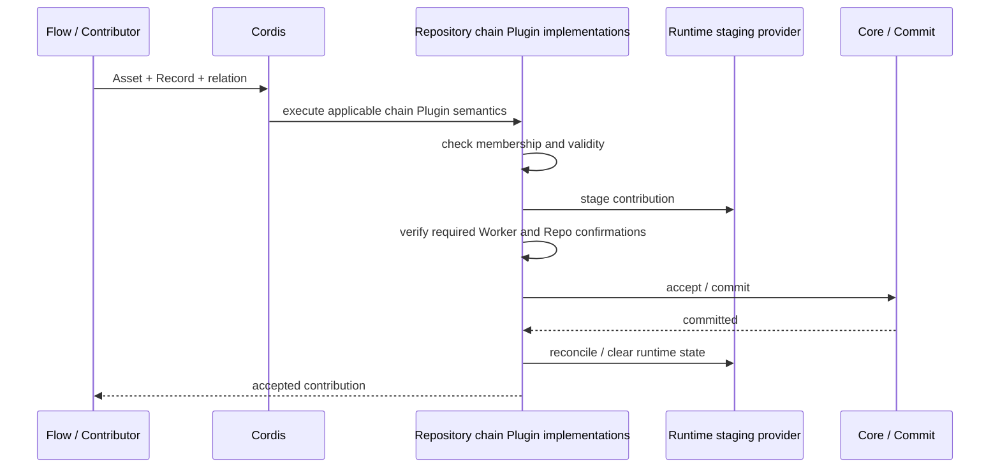
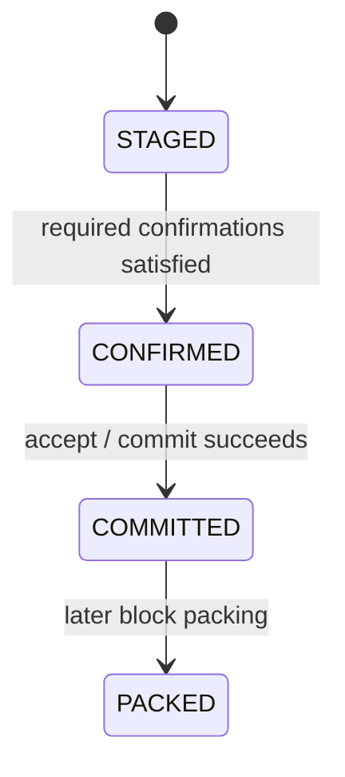

# Repository Architecture

Repository 采用 Cordis 的插件运行模型组织仓库能力。本页描述 Repository 的系统结构、插件边界、运行关系和数据流，是 `docs/requirements.md` 到 `specs/` 之间的 Design / Architecture 层。

当前 Architecture 只固定已经确认的结构原则。具体 chain Plugin 字段、包名、存储实现和 API 形式在进入 Spec 前不锁定。

## 架构原则

Repository 遵循 Cordis 的“万物皆插件”模型。能够独立装载、替换、声明依赖或管理生命周期的能力，默认以 Cordis plugin 组织。

Repository 不在 Cordis 之外再建立一套 Runner、Hoster、Plugin Manager、Service Container 或生命周期系统。插件发现、依赖、Context、Service、Effect 和生命周期由 Cordis 提供。

LabourChain 在链上需要被历史事实长期引用的可执行语义，由 Core 定义的 chain Plugin / PluginHash 表达。运行这些实现时仍使用 Cordis，不再建立平行的运行时插件体系。

```text
Cordis plugin
├── Chain Plugin implementation
│   └── 对应稳定的链上 Plugin identity / historical semantics
└── Runtime / product plugin
    └── 提供存储、索引、适配、展示等运行能力
```

这里的分类描述插件承担的职责，不形成第二套插件类型系统。

## Bootstrap

Repository 的可执行运行环境由一个稳定版本的 bootstrap 代码启动。

Bootstrap 的特殊之处只有一点：它具有可以由 Node.js / 操作系统直接启动的入口，并在启动时创建 Cordis application。Cordis 启动后，其余能力仍按普通插件方式装载和运行。

Bootstrap 自身保留稳定的 Plugin name/version；完整 chain Plugin artifact / PluginHash 在 Core 的 release 边界形成。Repository 当前开发阶段假设 Core 最终提供这一能力，不在 Bootstrap 中复制 Core 的 canonicalization 或 hashing 实现。



Bootstrap 不因此成为 Cordis 之外的协议管理层。它负责把运行环境启动起来，随后使用 Cordis 本身的插件机制。

Bootstrap 版本固定该运行实例采用的执行代码和 Cordis 运行环境。当前没有必要再建立独立的 execution-profile 或 runner-version 模型。

## Node

一个 LabourChain Repository node 是某个 Bootstrap 可执行版本的运行实例，以及该实例加载的 Cordis plugins、providers 和配置。

```text
Repository Node
=
Bootstrap executable
+ fixed Cordis runtime
+ loaded plugins
+ runtime providers
+ configuration
```

节点具有哪些 Repository 能力，取决于实际加载了哪些插件，而不是一个固定的 Repository mega-service。

## Chain Plugin implementation

Chain Plugin 是 Core 定义的不可变链上可执行 artifact；Repository 中对应的实现仍作为 Cordis plugin 被装载和运行。

已经存在并可能被历史事实引用的 Plugin identity 不通过修改旧实现语义来升级。新的语义形成新的 Plugin artifact / PluginHash。

同一节点可以按需要同时加载历史事实所要求的多个 Plugin 实现。解释或验证历史事实时必须解析事实实际引用的 Plugin identity，不能隐式替换为 `latest` 或其他版本。

Repository 不另行定义一套 Plugin metadata、hash 或 release identity。

## 插件边界

插件不按照 CRUD 操作或单个 Requirement 机械拆分。

拆分主要服从链上语义边界、版本边界和生命周期。一起升级、一起加载、一起失效且没有独立运行价值的紧密能力可以由同一个插件实现；能够被其他产品独立复用的能力应避免与 Repository 产品运行时绑定。

例如 Asset 和 Asset-Record relation 属于可能被 LabourFlow Personal Repo 复用的通用能力，不应要求调用方加载完整 Repository node 才能使用。

Contribution history 属于链上事实的 view / projection。它可以由插件提供查询、索引或缓存能力，但不需要为了概念完整性固定建立一个 History chain Plugin。

## Repository 与其他 LabourChain 组件



Repository 不重新定义 Core 已有的 identity、signature、Record、Plugin、commit 或 block 基础语义。Repository 领域能力通过 Core 暴露的服务和规范数据结构工作。

LabourFlow 中的 Personal Repo 是 Flow 的产品模块。它可以复用通用 Asset、Asset-Record relation 等能力，但不是 Repository package 的特殊模式，也不要求运行完整 Repository bootstrap。

## Contribution 数据流

Repo contribution 不是普通 CRUD。Worker 已经在 Repository 之外产生 Record，并可形成或修改 Asset；Repository 接收的是 Asset contribution，并参与该劳动的 Repo 侧确证。

当前流程为：



Contribution 的链上语义由对应 chain Plugin 定义；Cordis 负责运行这些插件，不额外引入一个把状态机写死的 Repository Runner。

## Contribution 状态

当前区分以下状态：



`STAGED` 是运行时处理状态，不是链上规范事实。`CONFIRMED` 表示该 contribution 已满足适用链上语义要求的确认条件，但只有成功 commit 后才成为已接受的 `COMMITTED` contribution。

`PACKED` 是后续 Core block packing 的结果，不属于 Repository 接受 contribution 的完成条件。

运行时可以持久保存 staging 以支持恢复，但持久化不会让 staging 变成 canonical fact。具体 durable staging、重试和 reconcile 机制在 Runtime provider 与 Spec 中确定。

## 数据与投影

Repository 不以 service-owned state 复制链上事实。

Record 始终是 Worker 的链上劳动事实。Asset、Repo、成员关系、confirmation 和 contribution relation 的规范含义由各自适用的 chain Plugin 语义定义。Repository 插件执行这些语义并提供仓库产品需要的能力。

Runtime 可以保存：

- Asset payload 或其他链上语义允许的持久内容；
- contribution staging；
- Repo / Asset 查询索引；
- contribution history projection；
- cache 和其他可重建运行数据。

其中 staging、index、projection 和 cache 都属于非规范运行数据。它们不能因为被持久化就成为链上事实。

Contribution history 由链上与 Repo contribution 相关的 Records 和关系投影得到。Repository 不维护规范的 `repo.records[]`。

## Cordis 生命周期

插件资源、依赖和运行时副作用服从 Cordis 生命周期。

Repository Architecture 不另行定义插件 activate / deactivate、依赖注入或 HMR 体系。插件需要的外部资源通过 Cordis 生命周期获取和释放，避免重复激活造成资源泄漏或全局状态污染。

## MVP 边界

Architecture 当前不锁定：

- 最终 npm package 名称和 monorepo 目录；
- Core chain Plugin release / distribution 的仓库集成方式；
- MongoDB、PostgreSQL、filesystem 等持久化实现；
- HTTP / REST / WebSocket 接口；
- UI；
- 高级 ACL 和角色体系；
- 搜索引擎；
- Project / Board 业务；
- Block packing 内部实现；
- 节点同步；
- 私有证明、收益分配和结算机制。

这些内容只有在 Requirement 明确进入范围后，才继续投影到 Design、Spec 和实现。
