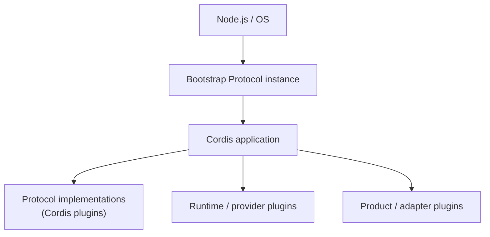
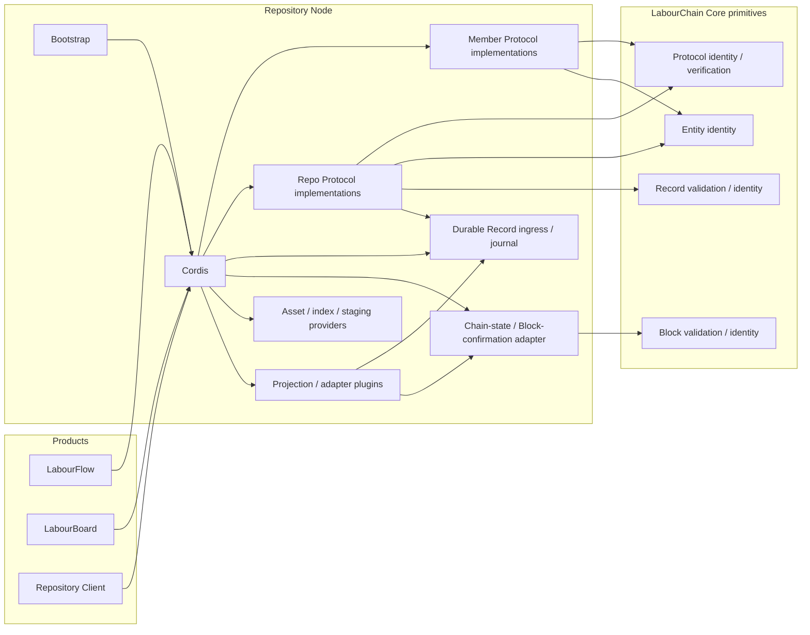
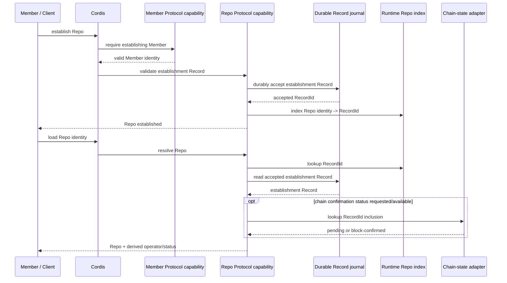
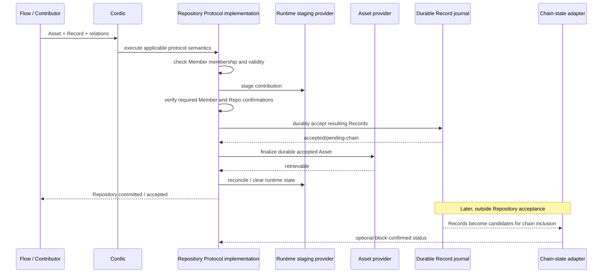
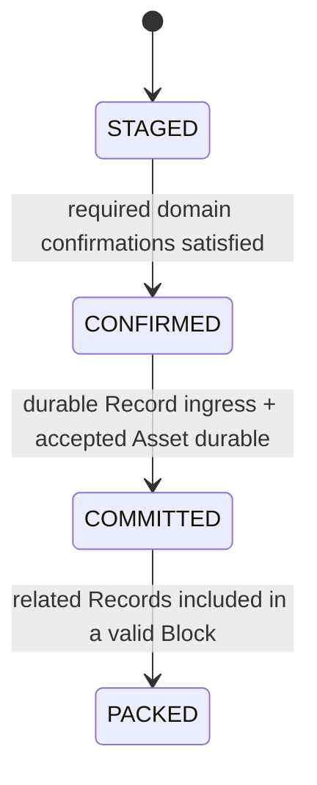

# Repository Architecture

Repository 采用 Cordis 的插件运行模型组织仓库能力。本页描述 Repository 的系统结构、插件边界、运行关系和数据流，是 `docs/requirements.md` 到 `specs/` 之间的 Design / Architecture 层。

当前 Architecture 只固定已经确认的结构原则。具体 Protocol 字段、包名、存储实现和 API 形式在进入 Spec 前不锁定。

## 架构原则

Repository 遵循 Cordis 的“万物皆插件”模型。能够独立装载、替换、声明依赖或管理生命周期的能力，默认以 Cordis plugin 组织。

Repository 不在 Cordis 之外再建立一套 Runner、Hoster、Plugin Manager、Service Container 或生命周期系统。插件发现、依赖、Context、Service、Effect 和生命周期由 Cordis 提供。

LabourChain 在 Cordis plugin 运行模型之上增加的是链上 Protocol 的稳定语义：需要被历史事实长期引用的协议行为以版本化 Protocol 声明，并由 Cordis plugin 作为其 executable implementation。

```text
LabourChain Protocol
└── executable implementation = Cordis plugin

Cordis plugins without chain-stable semantics
└── Runtime / product plugins
    └── 存储、索引、适配、展示等运行能力
```

Protocol 与 Cordis Plugin 描述不同层级：前者是链上稳定语义与身份，后者是唯一运行时插件抽象。不建立第二套插件类型系统。

## Bootstrap

Repository 的可执行运行环境由一个稳定版本的 bootstrap 代码启动。

Bootstrap 的特殊之处只有一点：它具有可以由 Node.js / 操作系统直接启动的入口，并在启动时创建 Cordis application。Cordis 启动后，其余能力仍按普通插件方式装载和运行。

Bootstrap 自身的稳定代码版本使用 Protocol 的格式声明。因此，一个正在运行的节点可以理解为某个 Bootstrap Protocol 版本的实例。



Bootstrap 不因此成为 Cordis 之外的协议管理层。它负责把运行环境启动起来，随后使用 Cordis 本身的插件机制。

Bootstrap 声明其兼容的 Cordis 版本范围，并与所加载插件共享同一个 Cordis runtime。当前不要求 Bootstrap Protocol 固定到某个精确的 Cordis patch 版本，也没有必要再建立独立的 execution-profile 或 runner-version 模型。

## Node

一个 LabourChain Repository node 是某个 Bootstrap Protocol 版本的运行实例，以及该实例加载的 Cordis plugins、providers 和配置。

```text
Repository Node
=
Bootstrap Protocol instance
+ Cordis
+ loaded plugins
+ runtime providers
+ configuration
```

节点具有哪些 Repository 能力，取决于实际加载了哪些插件，而不是一个固定的 Repository mega-service。

## Protocol implementation

LabourChain Protocol 定义链上稳定语义和协议版本；对应 executable implementation 是 Cordis plugin。

协议版本与实现一起演进。已经存在并可能被历史事实引用的协议版本不通过在同一个实现中修改分支语义来升级；新的协议语义使用新的版本实现。

```text
Protocol A v1 -> Cordis plugin implementation
Protocol A v2 -> Cordis plugin implementation
```

同一节点可以按需要同时加载多个协议版本。解释或验证历史事实时必须解析事实所引用的具体协议版本，不能隐式替换为当前最新版本。

Protocol 的具体 metadata 字段、发现形式和包命名在 Spec 阶段确定。Architecture 只要求能够稳定识别协议及其版本，并让对应 implementation 通过 Cordis 被加载。

## 插件边界

Cordis plugins 不按照 CRUD 操作或单个 Requirement 机械拆分。

拆分主要服从协议边界、版本边界和生命周期。一起升级、一起加载、一起失效且没有独立运行价值的紧密协议可以由同一个 Cordis plugin 实现；能够被其他产品独立复用的协议应避免与 Repository 产品运行时绑定。

Member、Repo、Asset 和 Asset-Record relation 都应首先按各自协议边界提供可组合能力。LabourFlow 等上层产品可以只加载所需协议，不应为了使用同 identity 的 Member + Repo 能力而加载完整 Repository 产品运行时。

Contribution history 属于事实的 view / projection。它可以由插件提供查询、索引或缓存能力，但不需要为了概念完整性固定建立一个 History Protocol。

## Core、Record ingress 与链确证边界

当前 LabourChain Core 提供 `core.protocol`、`core.record`、`core.entity`、`core.block` 等确定性协议原语。它们定义数据结构、身份表示、Record/Block 校验和密码学边界，但不因此成为一个固定的数据库、Record store、网络节点或 Repository 专用 commit service。

Core 当前同时明确：Block Chain 表达 Record 被这条链收录和确证的顺序；Runtime arrival / queue order 不具有链确证语义。因此 Repository 不把“本地持久接收 Record”和“Record 已被 Block 确认”混成一个 canonical 状态。

Repository node 需要区分两类运行能力：

```text
Durable Record ingress / journal
    -> 持久接收已经完成领域校验和签名的 Records
    -> 在 Block packing 之前跨重启保留 pending-chain Records
    -> 为 Repository committed / accepted 提供 durable runtime boundary
    -> 不宣称这些 Records 已经被链确证

Chain-state / Block-confirmation access
    -> 查询哪些 Records 已经被有效 Block 收录
    -> 提供链确证顺序与 block reference
    -> 用于状态升级、对账和 projection rebuild
```

二者可以由同一个未来 node/runtime 实现，也可以作为不同 Cordis providers 组合；Architecture 不锁定 package、数据库或网络实现。

Repository 领域插件只消费这些能力，不通过 `repo.records[]`、general-purpose Repository Record database 或第二套链来替代它们。

## Repository 与其他 LabourChain 组件



Repository 不重新定义 Core 已有的 Protocol、Record、Entity identity、signature 或 Block 语义。Member、Repo、Asset、membership、confirmation、Repo establishment 和 contribution relation 等领域语义由各自适用的上层 Protocol 定义。

Member 与 Repo 都是同一类组合原则：先有 Core Entity identity，再通过协议获得领域语义。一个 Entity identity/keypair 可以同时满足 Member 与 Repo 协议；这种组合不产生第二个 identity，也不自动产生所有权或私人财产语义。

LabourFlow 可以在同 identity Member + Repo 协议组合之上提供面向个人的产品体验，但它不需要创建一个嵌套 `PersonalRepo` entity，也不改变底层 Repo 协议。

## Repo establishment 数据流

Repo 是以 Core `EntityPublicKey` 为身份锚点的协议组合，不继承或扩展 Core `Entity` 对象。

Repo establishment 的发起方必须是一个已经满足 Member 协议的 Entity identity。集体 Repo 可以使用另一个独立的 Repo Entity identity；Member-scoped Repo 也允许 Member 与 Repo 使用同一个 identity/keypair。

MVP 的 Repo establishment 使用一个 establishment Record 表达最小事实：

```text
Record.createdBy
= establishing Member identity

Repo establishment Protocol interpretation:
Record.createdBy
= initial Repo operator

Record.data.repo
= Repo EntityPublicKey
```

`Record.createdBy` 本身不普遍等于 operator；是 Repo establishment Protocol 为这一类 Record 赋予 initial operator 语义。因此 operator 不需要在 Repo payload 和 Runtime provider 中再建立第二个规范来源。Core `Entity.introducedBy` 也不用于表达 operator、ownership 或 membership。

一个 establishment Record 可以处于两个不同的确认层级：

```text
accepted/pending-chain
    -> 已进入 durable Record journal
    -> Repository 可以恢复并加载该 Repo

block-confirmed
    -> establishment Record 已被有效 Block 收录
    -> 获得链确证状态
```

建立与重新加载的数据流为：



Runtime Repo index 只是加速 lookup 的可替换数据。initial operator 来自 establishment Protocol 对 establishment Record `createdBy` 的解释。缺失或陈旧的 index 不能创造第二个 operator；index 可以通过 durable journal，以及在可用时通过 chain state 重新对账。

## Contribution 数据流

Repo contribution 不是普通 CRUD。Member 已经在 Repository 之外产生 Record，并可形成或修改 Asset；Repository 接收的是 Asset contribution，并参与该劳动的 Repo 侧确证。

当前流程为：



Contribution 的协议语义由对应 Protocol 定义；其 implementation 由 Cordis 负责运行，不额外引入一个把状态机写死的 Repository Runner。Repository Runtime 需要维护一层领域感知的 Record database，用于保存已验证的 Record 关系、顺序/依赖和待打包集合，并作为后续关系验证与 Block packing 的运行时输入。Record ingress/journal、Runtime Record database 与 chain-state access 是三个不同职责：journal 保存 exact accepted Records；Runtime Record database 维护协议验证后的关系状态；chain state 回答已收录 Block 的链确证状态。Runtime Record database 不是第二条 blockchain，也不取代 Core Block / canonical-chain 语义。

## Contribution 状态

当前区分以下状态：



`STAGED` 是临时运行时处理状态，不是已接受 contribution。

`CONFIRMED` 表示 contribution 已满足适用协议要求的领域确认条件，但仍未达到 Repository acceptance。

`COMMITTED` 是 Repository 的 durable acceptance 边界：所需 Records 已进入可跨重启恢复的 durable journal，accepted Asset 已可持久读取。此时相关 Records 可以仍处于 pending-chain，不能描述为已经获得 Block confirmation。

`PACKED` 表示相关 Records 已被有效 Block 收录并获得链确证。它属于后续链运行过程，不是 Repository 对 contribution 返回 accepted 的前置条件。

## 数据与投影

Repository 不以领域 service-owned state 复制链确证事实。

需要区分四类 Runtime 数据：

```text
1. durable pending/accepted journal
   - 保存 Repository 已接受但可能尚未被 Block 收录的 exact Records
   - 在其安全进入链或交给等价 durable node runtime 前不能任意丢弃
   - 不是 Block confirmation

2. Runtime Record database
   - 维护通过适用 Protocol 验证后的 Record 关系、顺序/依赖与 pending packing state
   - Repository 的关系验证、追溯和后续 Block packing 消费这一层
   - 可以从 durable Records + exact Protocol semantics 重建/对账，但运行时不是纯查询缓存
   - 不自行赋予 Block confirmation，也不是 canonical-chain 数据库

3. staging
   - contribution 处理中的临时/恢复状态
   - 未达到 Repository acceptance

4. index / cache / projection
   - 查询与展示加速数据
   - 可由 Runtime Record database、journal 与 chain state 派生或重建
```

Runtime 还可以保存：

- Asset payload 或其他协议允许的持久内容；
- Repo identity -> establishment RecordId 等领域关系索引；
- 用于验证与打包的 Record relationship / dependency indexes；
- Asset 查询索引；
- contribution history projection；
- cache 和其他可重建运行数据。

本地持久化不会使 pending Record 自动变成 Block-confirmed fact。相反，chain-state adapter 也不负责 Repo 领域语义；它只回答 Record 是否已被链收录等链状态问题。

Contribution history 可以同时展示 Repository committed/pending-chain 与 block-confirmed contributions，但必须明确区分状态。

Repository 不维护一个将所有链 Records 归 Repository 所有的规范 `repo.records[]`。

## Cordis 生命周期

插件资源、依赖和运行时副作用服从 Cordis 生命周期。

Repository Architecture 不另行定义插件 activate / deactivate、依赖注入或 HMR 体系。插件需要的外部资源通过 Cordis 生命周期获取和释放，避免重复激活造成资源泄漏或全局状态污染。

## MVP 边界

Architecture 当前不锁定：

- 具体 npm package 名称和 monorepo 目录；
- Protocol metadata 最终字段；
- `member.profile` 的完整字段、更新和隐私模型；
- durable Record journal 的最终 package/service/API 形式；
- chain-state adapter 的最终 package/service/API 形式；
- MongoDB、PostgreSQL、filesystem 等持久化实现；
- HTTP / REST / WebSocket 接口；
- UI；
- 高级 ACL 和角色体系；
- 所有权、私人财产和收益分配协议；
- 搜索引擎；
- Project / Board 业务；
- Block packing 内部实现；
- 节点同步；
- 私有证明、收益分配和结算机制。

这些内容只有在 Requirement 明确进入范围后，或现有 Requirement 的实现确实需要稳定的结构边界时，才继续投影到 Design、Spec 和实现。
