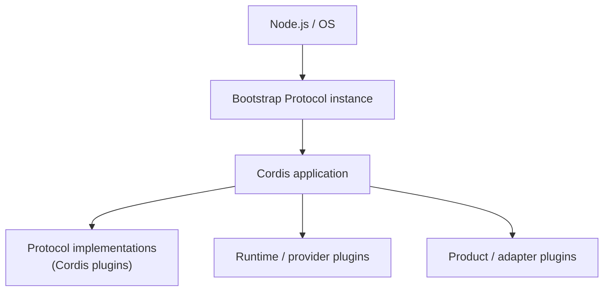
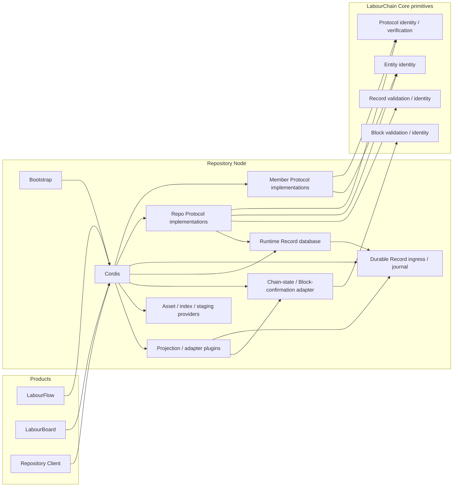
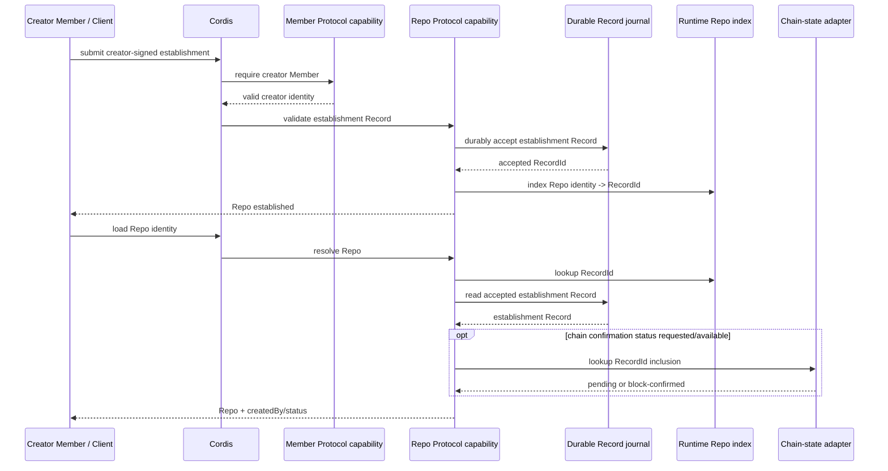
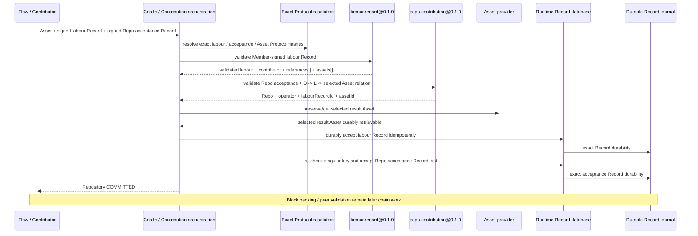
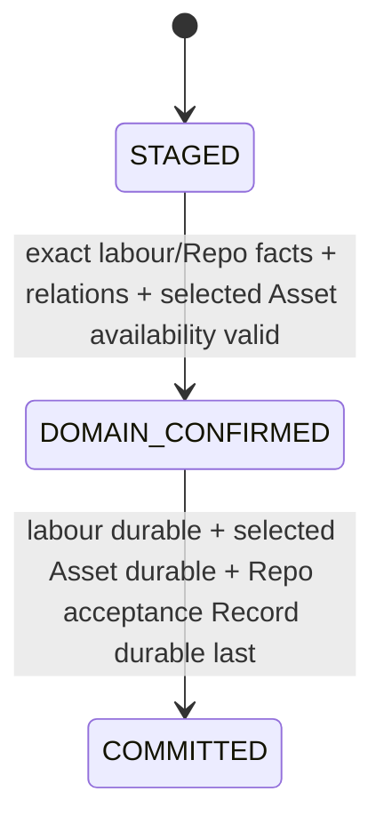

# Repository Architecture

Repository 采用 Cordis 的插件运行模型组织仓库能力。本页描述 Repository 的系统结构、插件边界、运行关系和数据流，是 `docs/requirements.md` 到 `specs/` 之间的 Design / Architecture 层。

当前 Architecture 只固定已经确认的结构原则。具体 Protocol 字段、包名、存储实现和 API 形式在进入 Spec 前不锁定。

## 架构原则

Repository 遵循 Cordis 的“万物皆插件”模型。能够独立装载、替换、声明依赖或管理生命周期的能力，默认以 Cordis plugin 组织。

Repository 不在 Cordis 之外再建立一套 Runner、Hoster、Plugin Manager、Service Container 或生命周期系统。插件发现、依赖、Context、Service、Effect 和生命周期由 Cordis 提供。

LabourChain 在 Cordis plugin 运行模型之上增加的是链上 Protocol 的稳定语义：需要被历史事实长期引用的协议行为以版本化 Protocol 声明，并由 Cordis plugin 作为其 executable implementation。

```text
LabourChain Protocol
└── executable implementation = Cordis plugin

Cordis plugins without chain-stable semantics
└── Runtime / product plugins
    └── 存储、索引、适配、展示等运行能力
```

Protocol 与 Cordis Plugin 描述不同层级：前者是链上稳定语义与身份，后者是唯一运行时插件抽象。不建立第二套插件类型系统。

## Bootstrap

Repository 的可执行运行环境由一个稳定版本的 bootstrap 代码启动。

Bootstrap 的特殊之处只有一点：它具有可以由 Node.js / 操作系统直接启动的入口，并在启动时创建 Cordis application。Cordis 启动后，其余能力仍按普通插件方式装载和运行。

Bootstrap 自身的稳定代码版本使用 Protocol 的格式声明。因此，一个正在运行的节点可以理解为某个 Bootstrap Protocol 版本的实例。


```mermaid
flowchart TD
    OS["Node.js / OS"]
    Bootstrap["Bootstrap Protocol instance"]
    Cordis["Cordis application"]
    Protocols["Protocol implementations\n(Cordis plugins)"]
    Runtime["Runtime / provider plugins"]
    Products["Product / adapter plugins"]

    OS --> Bootstrap
    Bootstrap --> Cordis
    Cordis --> Protocols
    Cordis --> Runtime
    Cordis --> Products
```

Bootstrap 不因此成为 Cordis 之外的协议管理层。它负责把运行环境启动起来，随后使用 Cordis 本身的插件机制。

Bootstrap 声明其兼容的 Cordis 版本范围，并与所加载插件共享同一个 Cordis runtime。当前不要求 Bootstrap Protocol 固定到某个精确的 Cordis patch 版本，也没有必要再建立独立的 execution-profile 或 runner-version 模型。

## Node

一个 LabourChain Repository node 是某个 Bootstrap Protocol 版本的运行实例，以及该实例加载的 Cordis plugins、providers 和配置。

```text
Repository Node
=
Bootstrap Protocol instance
+ Cordis
+ loaded plugins
+ runtime providers
+ configuration
```

节点具有哪些 Repository 能力，取决于实际加载了哪些插件，而不是一个固定的 Repository mega-service。

## Protocol implementation

LabourChain Protocol 定义链上稳定语义和协议版本；对应 executable implementation 是 Cordis plugin。

协议版本与实现一起演进。已经存在并可能被历史事实引用的协议版本不通过在同一个实现中修改分支语义来升级；新的协议语义使用新的版本实现。

```text
Protocol A v1 -> Cordis plugin implementation
Protocol A v2 -> Cordis plugin implementation
```

同一节点可以按需要同时加载多个协议版本或多个历史 Protocol artifacts。人类可读的 `name@version` 用于表达 Protocol reference，但历史解释和验证的机器权威是事实实际携带的 exact `ProtocolHash`。节点不能仅凭相同版本号、兼容范围或本地最新版本选择 implementation。

历史解析必须以 `ProtocolHash` 精确取得对应 descriptor / executable artifact，使用 Core 提供的验证边界核对 descriptor、artifact 与 hash，并确认其人类可读 Protocol reference 与事实声明一致。缺失 exact hash 时必须失败，不能 fallback 到 `latest`、同版本的另一 artifact 或“看起来兼容”的实现。

Protocol 的具体发现形式和包命名在 Spec 阶段确定。Architecture 不建立第二套插件管理器；验证后的 executable implementation 仍通过 Cordis 被加载。

## 插件边界

Cordis plugins 不按照 CRUD 操作或单个 Requirement 机械拆分。

拆分主要服从协议边界、版本边界和生命周期。一起升级、一起加载、一起失效且没有独立运行价值的紧密协议可以由同一个 Cordis plugin 实现；能够被其他产品独立复用的协议应避免与 Repository 产品运行时绑定。

Member、`labour.record`、Repo、Asset 和 contribution relation 都应首先按各自协议边界提供可组合能力。`labour.record@0.1.0` 与 `asset.content@0.1.0` 都是独立 Cordis Protocol implementations，不依赖 Board/Project 产品模型。LabourFlow 等上层产品可以只加载所需协议，不应为了使用同 identity 的 Member + labour Record + Asset + Repo 能力而加载完整 Repository 产品运行时.

Contribution history 属于事实的 view / projection。它可以由插件提供查询、索引或缓存能力，但不需要为了概念完整性固定建立一个 History Protocol。

## Core、Record ingress 与链确证边界

当前 LabourChain Core 提供 `core.protocol`、`core.record`、`core.entity`、`core.block` 等确定性协议原语。它们定义数据结构、身份表示、Record/Block 校验和密码学边界，但不因此成为一个固定的数据库、Record store、网络节点或 Repository 专用 commit service。

Core 当前同时明确：Block Chain 表达 Record 被这条链收录和确证的顺序；Runtime arrival / queue order 不具有链确证语义。因此 Repository 不把“本地持久接收 Record”和“Record 已被 Block 确认”混成一个 canonical 状态。

Repository node 需要区分不同权威层级的运行能力：

```text
Repo-local Runtime operational state
    -> staging / request-submission correlation / processing phase / retry
    -> organization-management data / local pending work / query support
    -> 可以按产品需要持久化并跨重启恢复
    -> 只描述本节点正在做什么，不是 Protocol fact 或 chain consensus

Durable Record ingress / journal
    -> 持久保存 exact accepted Records
    -> 在 Block packing 之前跨重启保留 pending-chain Records
    -> 不负责 Repository 领域关系验证
    -> 不宣称这些 Records 已经被链确证

Runtime Record database
    -> 提供同一 Repository Runtime 的 serialized Record ingress boundary
    -> 复用 journal 的 exact Record durability
    -> #9 的 concrete relation 保留在 signed labour / acceptance facts 中
    -> 仅在实际需要时维护可重建的窄索引，不预设通用业务状态容器
    -> 不是 generic operational database，也不是 canonical chain state

Chain-state / Block-confirmation access
    -> 查询哪些 Records 已经被有效 Block 收录
    -> 提供链确证顺序与 block reference
    -> 用于状态升级、对账和 projection rebuild

Network delivery state
    -> Block/message broadcast、delivery retry 与 pending delivery
    -> 只描述技术投递进度
    -> 不改变 Repository COMMITTED，也不构成 Contribution recovery
```

这些能力可以由同一个未来 node/runtime 实现，也可以作为不同 Cordis providers 组合；Architecture 不锁定 package、MongoDB/PostgreSQL/filesystem 等数据库或网络实现。Runtime Record database 保持围绕 Record ingress 的窄边界；#10 若需要 durable staging/correlation，可以使用独立的普通 Runtime state provider，而不必把每个本地业务/流程状态提升为 Core Record 或 Protocol fact。#9 的关系由 signed facts 自身表达，因此仍不新增 generic relation state。若实现确实需要，可增加由 durable facts 重建的窄索引，但不预设通用 DAG schema、SQL 模型、namespace state framework 或 packer API。

Repository 领域插件消费这些运行能力，但不通过 `repo.records[]` 或第二套链来替代 Core Block / canonical-chain 语义。

## Asset Protocol 与持久化边界

Asset 的领域 identity 与 Repository 的存储 identity 必须分离。当前 MVP 的
`asset.content@0.1.0` 固定最小 Asset：

```text
exact content bytes
    -> contentHash

protocol + protocolHash + contentHash
    -> deterministic AssetId
```

AssetId 使用与 Core Record identity 相同的 RFC 8785 JCS + DoubleSHA256
确定性约定，但它不是 RecordId，也不把 Asset 变成 Core Record。Core 已有的
`ProtocolHash` / exact artifact verification 直接复用；Repository 不为 Asset
复制第二套 Protocol identity。

Asset identity 不包含 Repo、Member、RecordId、createdAt、filename、
`previous`、`pid` 或 provider-native key。生产来源和使用关系由已有
labour Records 表达：

```text
Record.assets[]      -> directly associated result AssetIds
Record.references[]  -> confirmed upstream AssetIds
```

因此 `old Asset -> labour -> new Asset` 的顺序以及一个 Asset 被多个后续
labour Records 使用的分支关系，都从实际 Record/Asset 引用重建。Repository
不建立 Asset DAG engine、reverse-link registry 或 generic relation store。

Asset storage 是可替换 Runtime provider，只负责精确 durable bytes。最小边界
等价于：

```text
preserve(exact Asset)
get(AssetId)
has(AssetId)
```

一次成功 preserve 必须使完整 descriptor + exact bytes 在重启后仍可读取；
中断写入不能通过 get/has 暴露成完整 Asset。`asset.content@0.1.0` 将 raw
content 明确限制为最多 16 MiB，使当前完整 `Uint8Array` 路径具有确定的资源
边界；更大或 streaming Asset 留给未来 Protocol/provider 演进，不在 #8
引入新的 streaming framework。

精确重复写入幂等。incoming Asset 必须先通过 size、contentHash、AssetId 与
exact Protocol/reference validation，之后才按 AssetId 查询 durable state；
因此任意 same-id/different-bytes 输入首先是 InvalidAsset，只有 canonical-valid
incoming Asset 与既有 durable descriptor/bytes 冲突时才是
AssetIdentityConflict，并且绝不覆盖既有内容。

Asset 的 durable existence 本身不是 Repository acceptance。Repo→Asset
关系与 Asset 浏览列表来自 accepted contribution facts/state，而不是 Asset
storage 内的 canonical registry。#9 Contribution 负责协调 durable Records、
durable Asset 与 acceptance fact；不同 provider 不需要被强行塞进一个分布式
transaction。当前正常 #9 顺序明确先持久化 selected Asset，再持久化 labour
Record，最后 durable accept Repo acceptance Record `D`。因此正常中断 seam
是“只有 A”、“A + L”或“A + L + D = COMMITTED”；“L 已由本次 contribution
持久化但 selected A 尚未完成”不是正常 #9 写序产生的状态。#10 只需用
Repo-local staging/correlation 与这些 durable facts 做幂等对账，不需要为此
发明新的链上 recovery fact。

缺失 Asset reference 在 storage 层只表现为 explicit not-found。
`labour.record@0.1.0` 的创建仍不要求本地 resolution；某个 Contribution
是否必须取得 referenced Asset，由其适用 Protocol 决定。

## Repo Runtime 与链上信任边界

Repository Runtime 是正常节点生成、接收、校验、组织和打包候选事实的执行路径，但它不是 LabourChain 的最终可信执行边界。节点可以使用官方开源 Repository 与 Protocol plugins 形成自洽的候选 Records，也可以使用等价实现；一个恶意或非标准节点甚至可以绕过正常 Repository 流程手工构造候选 Block。链上有效性不能建立在“生产者确实运行了官方 Repo 代码”这一假设上。

Block 被其他节点接受之前，Repository 本地的 pending / candidate state 都可以继续被修订、替换或放弃。这里需要区分两种不同的不变性：

```text
specific signed Record
    -> RecordId / signature 约束这个具体 Record 的内容
    -> 修改其签名覆盖的内容后，原 RecordId / signature 不再证明修改后的值
    -> 若要形成新的有效事实，应重新形成对应的有效 Record

candidate set before Block confirmation
    -> Repo 可以选择、替换、追加或放弃待打包 Records
    -> journal / Runtime database 只描述节点当前接受和准备处理的状态
    -> 这些状态本身不是 canonical chain truth
```

因此 Repository 的本地 validation 主要服务于正常节点的运行自洽、恢复、关系维护和打包准备。它可以尽早拒绝明显非法的事实，但 peer node 不信任生产节点已经执行过这些检查，也不把 Runtime database、journal、snapshot 或本地 plugin 执行结果作为链级证明。

当下一版 Core Block packing 能力实现后，Header 只增加由 Records 自身确定性派生的 `vroot`。Block 不保存第二份 ValidationManifest，也不在 Header 重复列出 Runtime plugin / Protocol composition：

```text
Block.records[]
    -> extract (protocol, protocolHash)
    -> reject same protocol / different hash ambiguity
    -> deduplicate
    -> canonical sort
    -> JCS
    -> DoubleSHA256
    -> Header.vroot

Peer validator
    -> L0: recompute recordsRoot + vroot and verify Block signature
    -> L1: read exact ProtocolHash values from actual Records
    -> resolve / verify exact Protocol implementations and dependencies
    -> independently validate Record semantics and Protocol-defined relations
    -> accept Block only after validation succeeds
```

Peer validation 不依赖生产节点之前使用了什么内存对象、snapshot 或执行路径，而只依赖 Block 实际提交的数据及其绑定的验证语义。当前 LabourChain 不要求像通用智能合约平台那样建立一套加密虚拟机或把所有 Repository 执行过程复制到链上；需要重放的是对应 Protocol 对 Block 内容及关系的确定性验证。

Block 内的 Records 可以按照适用 Protocol 建立一个或多个有逻辑的生产关系结构。劳动与 Asset 的输入/输出关系自然形成 tree / forest，必要时可表现为更一般的依赖图；L1 validation 必须使用 Records 直接引用的 exact Protocol semantics 重建并验证这些关系。Repo creation provenance、decision operator 等非生产因果事实不因此被强行塞入同一棵生产树，也不重新引入 `previous` 链。

当前 Repository MVP 只建立支持未来打包所需的 Runtime 边界，不实现完整 Block packer、`vroot` Core contract、peer validator、节点同步或共识。

## Repository 与其他 LabourChain 组件


```mermaid
flowchart LR
    subgraph Products["Products"]
        Flow["LabourFlow"]
        Board["LabourBoard"]
        Client["Repository Client"]
    end

    subgraph Node["Repository Node"]
        Bootstrap["Bootstrap"]
        Cordis["Cordis"]
        MemberProtocols["Member Protocol implementations"]
        RepoProtocols["Repo Protocol implementations"]
        Journal["Durable Record ingress / journal"]
        RuntimeDB["Runtime Record database"]
        ChainState["Chain-state / Block-confirmation adapter"]
        Providers["Asset / index / staging providers"]
        Views["Projection / adapter plugins"]
    end

    subgraph Core["LabourChain Core primitives"]
        Protocol["Protocol identity / verification"]
        Entity["Entity identity"]
        Record["Record validation / identity"]
        Block["Block validation / identity"]
    end

    Bootstrap --> Cordis
    Cordis --> MemberProtocols
    Cordis --> RepoProtocols
    Cordis --> Journal
    Cordis --> RuntimeDB
    Cordis --> ChainState
    Cordis --> Providers
    Cordis --> Views

    Flow --> Cordis
    Board --> Cordis
    Client --> Cordis

    MemberProtocols --> Protocol
    MemberProtocols --> Entity
    RepoProtocols --> Protocol
    RepoProtocols --> Entity
    RepoProtocols --> Record
    RepoProtocols --> RuntimeDB
    RuntimeDB --> Journal
    Views --> Journal
    Views --> ChainState
    ChainState --> Block
```

Repository 不重新定义 Core 已有的 Protocol、Record、Entity identity、signature 或 Block 语义。Core Record 只是通用签名事实容器；劳动记录由 `labour.record@0.1.0` 把 `labourRecord` 作为 `Record.data` 解释。当前 #9 的 Repo 侧采纳事实由具体的 `repo.contribution@0.1.0` 定义，而不是继续依赖一个未指定的 generic confirmation / relation Protocol。未来其他领域事实仍由各自具体 Protocol 定义。

Member 与 Repo 都是同一类组合原则：先有 Core Entity identity，再通过协议获得领域语义。一个 Entity identity/keypair 可以同时满足 Member 与 Repo 协议；这种组合不产生第二个 identity。Repo establishment 只保留创建事实与创建来源，不定义 Repo ownership，也不自动扩展为 Asset 或劳动成果的私人财产权。

LabourFlow 可以在同 identity Member + Repo 协议组合之上提供面向个人的产品体验，但它不需要创建一个嵌套 `PersonalRepo` entity，也不改变底层 Repo 协议。

## Repo establishment 与操作留痕

Repo 是以 Core `EntityPublicKey` 为身份锚点的协议组合，不继承或扩展 Core `Entity` 对象。

Repo establishment 的创建者必须是一个已经满足 Member 协议的 Entity identity。集体 Repo 可以创建另一个独立的 Repo Entity identity；Member-scoped Repo 也允许创建者与 Repo 使用同一个 identity/keypair。

MVP 的 Repo establishment 使用一个由创建者个人签名的 Record 表达最小事实：

```text
Record.createdBy
= creator Member EntityPublicKey

Record.signature
= creator personal signature

Record.data.publicKey
= created Repo EntityPublicKey
```

这与 Core Entity fact 的责任分离保持一致：`Record.createdBy / signature` 表示谁确认了创建事实，`Record.data.publicKey` 表示这条事实声明的 Repo identity。创建关系只用于 provenance，不解释为 ownership、永久控制权、membership 或治理授权。Core `Entity.introducedBy` 同样不用于推导这些政治/组织语义。

Repo 后续采取需要链上留痕的决定时，决定 Record 由 Repo identity 的 private key 签名，并在该 Protocol 的签名 payload / data 中标注实际 `operator: EntityPublicKey`。operator 是单次行为的责任留痕，不是持久角色、membership、ACL 或组织授权证明。谁可以操作 Repo key、如何授权、复核或进行多人治理属于后续组织治理层。

劳动者与 Repo 不建立额外链上 membership。产品可以从 accepted contributions 派生 contributor/member 视图，也可以在本地软件中维护人员分组、标签和筛选条件；这些运行数据不参与链级 validity。

一个 establishment Record 可以处于两个不同的确认层级：

```text
accepted/pending-chain
    -> 已进入 durable Record journal
    -> Repository 可以恢复并加载该 Repo

block-confirmed
    -> establishment Record 已被有效 Block 收录
    -> 获得链确证状态
```

建立与重新加载的数据流为：


```mermaid
sequenceDiagram
    participant Creator as Creator Member / Client
    participant Cordis as Cordis
    participant MemberProtocol as Member Protocol capability
    participant Repo as Repo Protocol capability
    participant Journal as Durable Record journal
    participant Index as Runtime Repo index
    participant Chain as Chain-state adapter

    Creator->>Cordis: submit creator-signed establishment
    Cordis->>MemberProtocol: require creator Member
    MemberProtocol-->>Cordis: valid creator identity
    Cordis->>Repo: validate establishment Record
    Repo->>Journal: durably accept establishment Record
    Journal-->>Repo: accepted RecordId
    Repo->>Index: index Repo identity -> RecordId
    Repo-->>Creator: Repo established

    Creator->>Cordis: load Repo identity
    Cordis->>Repo: resolve Repo
    Repo->>Index: lookup RecordId
    Repo->>Journal: read accepted establishment Record
    Journal-->>Repo: establishment Record
    opt chain confirmation status requested/available
        Repo->>Chain: lookup RecordId inclusion
        Chain-->>Repo: pending or block-confirmed
    end
    Repo-->>Creator: Repo + createdBy/status
```

Runtime Repo index 只是加速 lookup 的可替换数据。Repo identity 来自 establishment Record 的 `data.publicKey`，创建来源来自该 Record 的 `createdBy`。缺失或陈旧的 index 不能创造第二条创建事实；index 可以通过 durable journal，以及在可用时通过 chain state 重新对账。

## Contribution 数据流

Repo contribution 不是普通 CRUD。Member 已经在 Repository 之外产生并签名
`labour.record@0.1.0`；Repo 侧采纳同样以一个已经由 Repo identity
签名的 `repo.contribution@0.1.0` Record 表达。#9 orchestration 消费这些
signed facts，不接管 Member 或 Repo private key。

当前请求只需要：

```text
selected Asset
+ Member-signed labour Record
+ Repo-signed acceptance Record
```

Member-side confirmation 就是 labour Record 本身。生产关系由
`labour.references[] / labour.assets[]` 表达。Repo acceptance Record 只额外
表达 Repo 独立采纳哪一个 result Asset，以及实际 operator：

```text
Record.createdBy
= Repo EntityPublicKey

Record.data
= {
    labourRecordId,
    assetId,
    operator
  }
```

其中 `assetId` 必须出现在所引用 labour Record 的 `assets[]`。保留这个
字段不是复制 production lineage，而是允许 Repo 在一个 labour Record
包含多个结果时只采纳其中一个结果。

正常 #9 数据流为：


```mermaid
sequenceDiagram
    participant Consumer as Flow / Contributor
    participant Cordis as Cordis / Contribution orchestration
    participant Resolve as Exact Protocol resolution
    participant Labour as labour.record@0.1.0
    participant Accept as repo.contribution@0.1.0
    participant Assets as Asset provider
    participant RuntimeDB as Runtime Record database
    participant Journal as Durable Record journal

    Consumer->>Cordis: Asset + signed labour Record + signed Repo acceptance Record
    Cordis->>Resolve: resolve exact labour / acceptance / Asset ProtocolHashes
    Cordis->>Labour: validate Member-signed labour Record
    Labour-->>Cordis: validated labour + contributor + references[] + assets[]
    Cordis->>Accept: validate Repo acceptance + D -> L -> selected Asset relation
    Accept-->>Cordis: Repo + operator + labourRecordId + assetId
    Cordis->>Assets: preserve/get selected result Asset
    Assets-->>Cordis: selected result Asset durably retrievable
    Cordis->>RuntimeDB: durably accept labour Record idempotently
    RuntimeDB->>Journal: exact Record durability
    Cordis->>RuntimeDB: re-check singular key and accept Repo acceptance Record last
    RuntimeDB->>Journal: exact acceptance Record durability
    Cordis-->>Consumer: Repository COMMITTED

    Note over Journal,Consumer: Block packing / peer validation remain later chain work
```

`repo.contribution@0.1.0` 的 Protocol service 只负责该 signed fact 与
cross-Record relation 的语义验证，不负责 Asset storage、Record persistence、
staging、history 或 Block 状态。Repository orchestration 负责 durable ordering。

当前 Runtime Record database 的 serialized ingress boundary 足以完成 #9
correctness。关系已经写在 durable signed facts 中：

```text
Repo acceptance Record
    -> labourRecordId
    -> labour.assets[] selected Asset
    -> labour.references[] confirmed upstream references
```

因此 #9 不建立 generic relation database。为了同一进程内 conflict check 或
后续查询，可以维护一个可重建的窄索引：

```text
(Repo, labourRecordId, assetId) -> acceptance RecordId
```

该索引不是 acceptance truth，也不是 canonical-chain state。

## Contribution 状态

Repository execution 与 chain confirmation 是两个不同维度。

Repository execution：


```mermaid
stateDiagram-v2
    [*] --> STAGED
    STAGED --> DOMAIN_CONFIRMED: exact labour/Repo facts + relations + selected Asset availability valid
    DOMAIN_CONFIRMED --> COMMITTED: labour durable + selected Asset durable + Repo acceptance Record durable last
```

`STAGED` 只是当前请求正在处理，没有 durable Repo acceptance marker。

`DOMAIN_CONFIRMED` 在当前 #9 中有具体含义：

- Member-signed `labour.record@0.1.0` 有效；
- Repo-signed `repo.contribution@0.1.0` 有效；
- acceptance 的 `labourRecordId` 与 labour Record 一致；
- acceptance 的 `assetId` 出现在 `labour.assets[]`；
- `labour.references[]` 保持已确认的上游生产/引用关系；其本地缺失本身不阻断当前 #9 acceptance；
- selected result Asset canonical-valid；
- 不存在同一 `(Repo, labourRecordId, assetId)` 的 distinct accepted fact。

它仍然不是 Repository acceptance，更不是 Block confirmation。

`COMMITTED` 的 durable final marker 是 Repo acceptance Record。只有在 labour
Record 与 selected result Asset 已达到当前 #9 的 durable 要求后，
该 acceptance Record 才能被 durable accept。完成这一步后才可以向 caller
报告 Repository accepted。

一个 fresh Runtime 可以从 durable acceptance Record 出发，重新读取并验证
labour Record 与 selected Asset，并从 `labour.references[]` 重建上游关系，确定同一 `COMMITTED` 结果；
不需要 process-local Contribution registry。

如果 acceptance marker 已经存在，但其依赖的 durable storage 当前损坏或不可读，
Runtime 必须显式暴露 integrity/storage failure，而不能把它伪装成健康的
`COMMITTED` 或“从未接受”。

Chain confirmation 另行表示：

```text
pending-chain
    -> block-confirmed
```

`pending-chain` 表示 Repository 已接受但尚无 accepted-chain evidence。只有
future chain-state / accepted Block evidence 表明相关 Records 已进入一个经过
独立验证并被接受的 Block，才能标记为 `block-confirmed`。

本地把 Records 放入 candidate Block、生成 Block 文件或完成打包动作本身都不
构成这个状态跃迁。

Block/message broadcast 与 delivery retry 也属于独立的 network delivery concern。一个已经 Repository `COMMITTED` 的 contribution 不会因为后续 Block 暂时无法广播而退回 pre-commit recovery；本地待广播 Block 可以保持 pending 并重试，而不把网络投递状态写回 Contribution 语义。

## 数据与投影

Repository 不以领域 service-owned state 复制链确证事实。

需要区分四类 Runtime 数据：

```text
1. durable pending/accepted journal
   - 保存 Repository 已接受但可能尚未被 Block 收录的 exact Records
   - 在其安全进入链或交给等价 durable node runtime 前不能任意丢弃
   - 不是 Block confirmation

2. Runtime Record database
   - 提供 Repository 的 serialized Record ingress boundary
   - 复用 durable Record journal 的 exact Record durability
   - #9 的 concrete relations 已由 signed Records 表达，不建立 generic relation store
   - 可选窄索引 (Repo, labourRecordId, assetId) -> acceptance RecordId 必须可重建
   - 不自行赋予 Block confirmation，也不是 canonical-chain 数据库

3. Repo-local operational state / staging
   - #10 可用于 interrupted pre-commit recovery 的 request/submission、phase、retry/correlation 等状态
   - 可以按节点可靠性需要持久化，但只具有本地 operational authority
   - 不属于 #9 COMMITTED predicate，不是 Protocol fact，也不能创造 acceptance
   - provider-native document/UUID/ObjectId 只作为本地存储 identity，不成为 ContributionId

4. index / cache / projection
   - 查询与展示加速数据
   - 可由 exact durable facts、Runtime Record database 与 chain state 派生或重建
```

Runtime 还可以保存：

- exact Asset descriptor + content bytes；
- Repo identity -> establishment RecordId 等领域关系索引；
- 从 signed labour/acceptance facts 重建的窄 contribution relation index（如果实现确实需要）；
- 从 accepted contributions 派生的 Repo Asset / 查询 projection；
- contribution history projection；
- cache 和其他可重建运行数据。

本地持久化不会使 pending Record 自动变成 Block-confirmed fact。相反，chain-state adapter 也不负责 Repo 领域语义；它只回答 Record 是否已被链收录等链状态问题。

Contribution history 可以同时展示 Repository committed/pending-chain 与 block-confirmed contributions，但必须明确区分状态。

Repository 不维护一个将所有链 Records 归 Repository 所有的规范 `repo.records[]`。


当前 #9 labour + Asset contribution 不需要 Patch。其 durable fact source 已经是：

```text
Member-signed labour Record
+ Repo-signed repo.contribution acceptance Record
```

Patch 继续作为未来某个具体 Protocol 的状态演化能力保留，只有实际 Requirement
进入范围后才定义对应 schema；Architecture 不为 #9 预设 generic Patch framework。

Snapshot 仍是节点基于 durable facts 与 exact Protocol semantics 物化出的
Runtime 状态，可用于恢复、读取、索引或计算，可以丢弃并重新计算。Snapshot
不进入 Record history，也不能反向覆盖 signed facts 或因为被 Runtime 缓存就
获得链上权威。

## Cordis 生命周期

插件资源、依赖和运行时副作用服从 Cordis 生命周期。

Repository Architecture 不另行定义插件 activate / deactivate、依赖注入或 HMR 体系。插件需要的外部资源通过 Cordis 生命周期获取和释放，避免重复激活造成资源泄漏或全局状态污染。

## MVP 边界

Architecture 当前不锁定：

- 具体 npm package 名称和 monorepo 目录；
- Protocol metadata 最终字段；
- `member.profile` 的完整字段、更新和隐私模型；
- durable Record journal 的最终 package/service/API 形式；
- chain-state adapter 的最终 package/service/API 形式；
- MongoDB、PostgreSQL、filesystem 等持久化实现；
- HTTP / REST / WebSocket 接口；
- UI；
- 高级 ACL 和角色体系；
- 所有权、私人财产和收益分配协议；
- 搜索引擎；
- Project / Board 业务；
- Block packing 内部实现；
- 节点同步；
- 私有证明、收益分配和结算机制。

这些内容只有在 Requirement 明确进入范围后，或现有 Requirement 的实现确实需要稳定的结构边界时，才继续投影到 Design、Spec 和实现。
